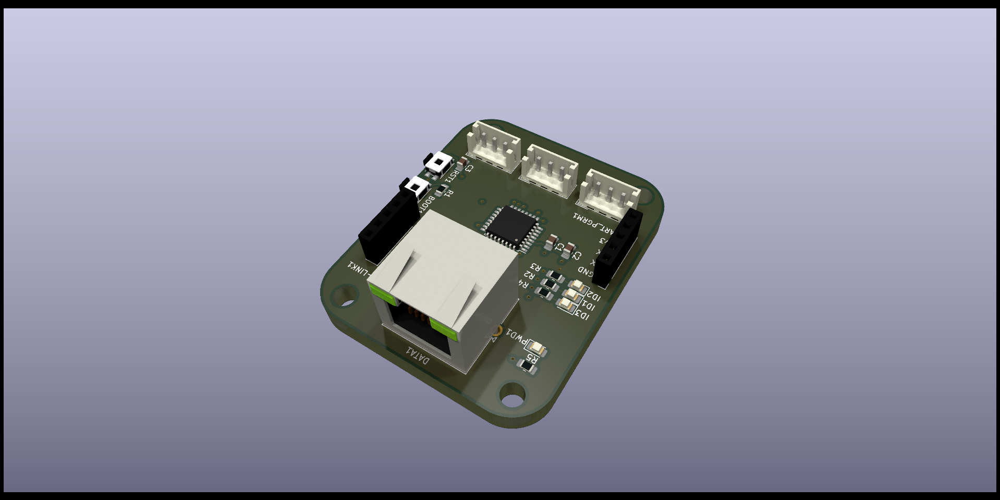
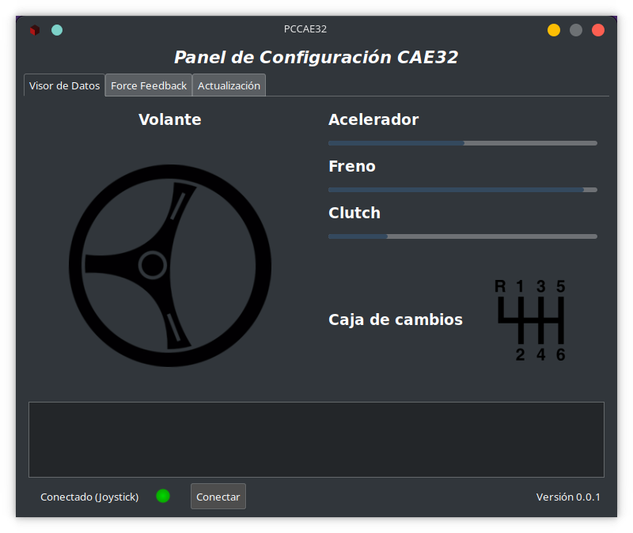

# CAE32

CAE32 es un proyecto de construcción y desarrollo de todas las etapas de un volante para videojuegos de PC,
para el sistema operativo de GNU/Linux.

Si quiere contribuir revisa el archivo [CONTRIBUTING.md](./CONTRIBUTING.md)

If you want to contribute, please read the [CONTRIBUTING.md](./docs/CONTRIBUTING-english.md) file.

## Las etapas son:

* Diseño PCB
* Firmware
* Driver (Kernel module en caso que sea necesario)
* Configuración y calibración por medio de una interfaz de usuario (GTK-3)
* Diseño de mecanismos para pedales, palanca de cambios y volante
* Diseño PCB de potencia para el control del motor de retroalimentación (FFB)

## Descripción detallada

### Pedales

## Version 1.0

- Placa para la captura de señales analogicas (STM32G070KBT6)

## Version 2.0

- Placa Para la captura de señales analogicas (STM32F072RBT6)

Tiene varias mejoras en comparación a la primera versión para mas información visita
el siguiente [archivo](./Esquematicos/CAE32_PCB/Pedals/README.md)

### Firmware

Estoy usando el framework de Espressif (ESP-IDF)

Se usa el microcontrolador STM32G070KBT6, en conjunto con el software
STM32CubeIDE y para programarlo es necesario la utilidad STM32CubeProgrammer,
ademas de una conexión con un "USB-UART bridge"

### Interfaz de usuario

La interfaz está desarrollada con el framework (GTK 3), esta permitirá hacer configuraciones, como por ejemplo:

* Visualización de los datos gráficamente y textual (consola)
* Tipo de transmisión (Manual, Automática, Secuencial, custom) **De forma nativa**
* Límites de los pedales, sensibilidad 
* Tipo de pedal
	* Entrada analógica (Potenciómetro, efecto hall)
	* Entrada SPI,I2c (Sensor personalizado)
	* Entrada para celula de carga

* Actualización de firmware

Diseño de interfaz hasta el momento.

**Para compilar el proyecto puedes usar el contenedor o construirlo en tu sistema(cumpliendo con las dependencias),
revisa el directorio: Codigo -> Interfaz_grafica**

