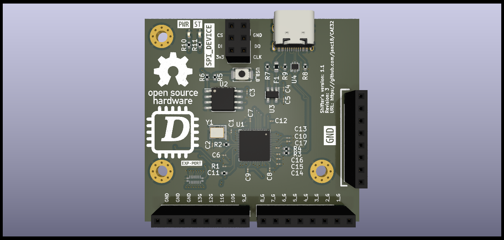

# CAE32

CAE32 is a project for building and developing all stages of a gaming wheel for PC, specifically for the GNU/Linux operating system.

If you want to contribute, please read the [CONTRIBUTING.md](./CONTRIBUTING.md) file.

## Overall current status

### PCBs

### Firmware

Because I don't have the PCBs right now, the best option is to do a state diagram for each PCB

### Software

Improving the compilation and flags for the user interface

## The stages include:

* PCB Design
* Firmware
* Driver (Kernel module if necessary)
* Configuration and calibration through a graphical user interface (GTK-3)
* Design of mechanisms for pedals, gear lever, and wheel
* Power PCB design for feedback motor control (FFB)

## Pedals

### Version 1.0

- Board for capturing analog signals (STM32G070KBT6)

### Version 2.0

- Board for capturing analog signals (STM32F072RBT6)

It has several improvements compared to the first version. For more information, visit the following [file](./Esquematicos/CAE32_PCB/Pedals/README.md)

### PCB Sponsored by PCBWay

The PCB quality is excellent, the contact with the support service is good, they responded very quickly in the case of any issue, 
and it has a good PCB finish using the STM assembly service,  all the IC pads are correctly soldered. Overall, the total cost of 5 PCBs 
and 2 PCBs with the assembly service is a very accessible, so I will keep using PCBWAY to build the next PCB iterations

[PCBWay Webpage](https://www.pcbway.com/)

## Shifter

### Version 1.0

- Board for capturing digital signals form gear shifts (RP2040)

## Programming Frameworks and Tools

* Espressif (ESP-IDF)

* STM32CubeIDE
* STM32CubeProgrammer
* USB-UART bridge

### User Interface

The interface is developed with the GTK 3 framework, which will allow configurations such as:

* Visualization of data graphically and textually (console)
* Transmission type (Manual, Automatic, Sequential, custom) **Natively**
* Pedal limits, sensitivity
* Pedal type
  * Analog input (Potentiometer, Hall effect, and load cell)
  * SPI, I2C input (Custom sensor)
* Firmware update

**To compile the project, you can use the container or build it on your system (meeting the dependencies). Check the directory: Code -> Graphical_Interface**

Current interface design

